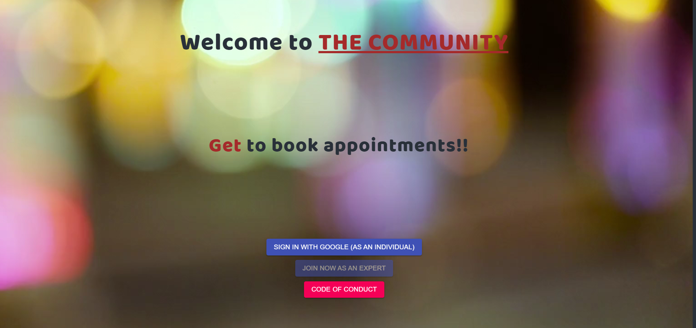
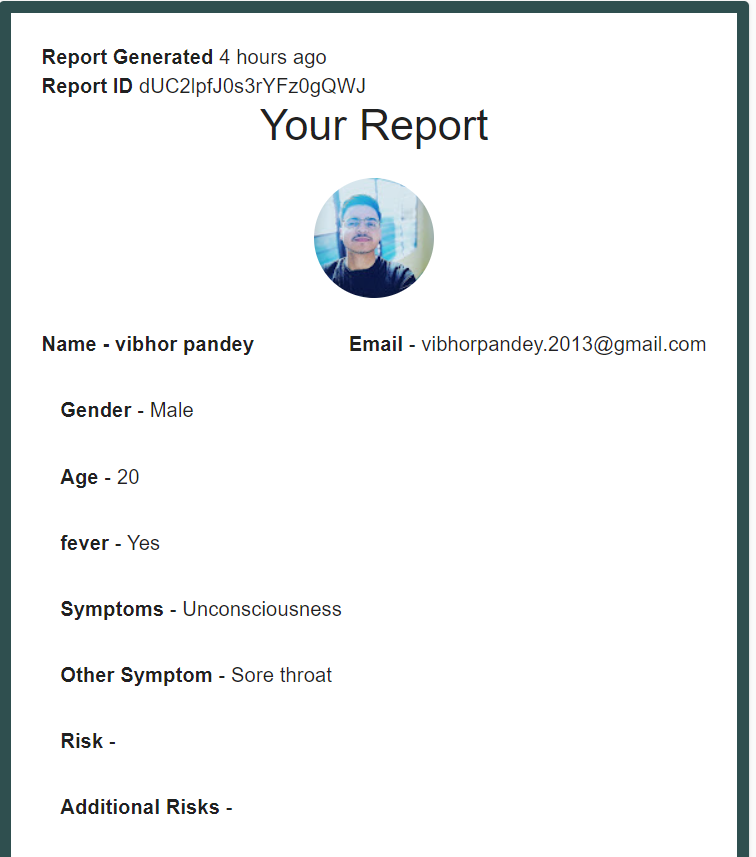
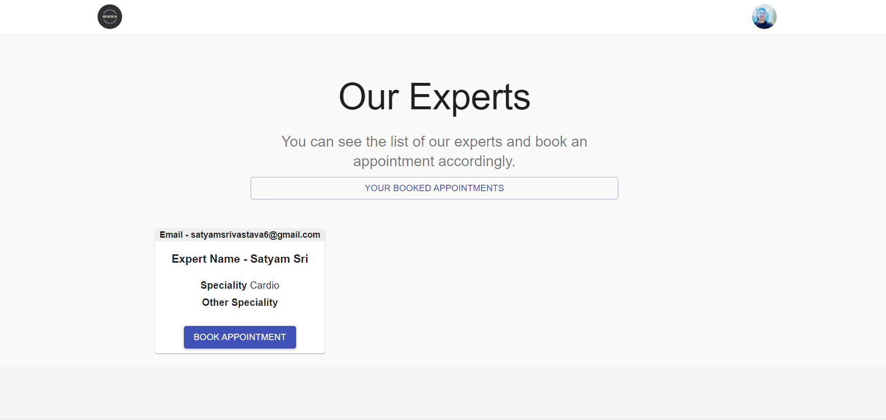
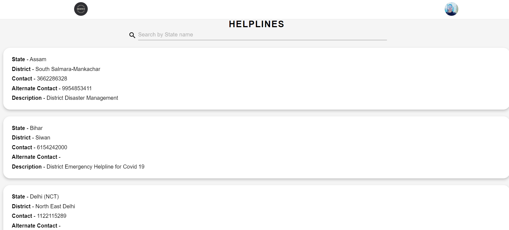
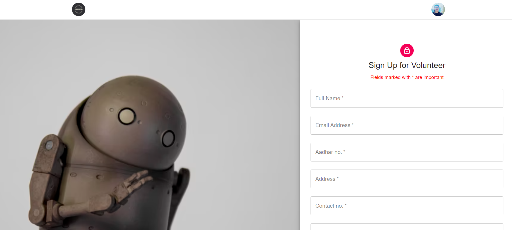

<h1 align='center'>⚕️⚕️**Covid-Assistance-Outlet**⚕️⚕️</h1>

## Link
  Working Project Video-[click Here](https://youtu.be/fv_2LjreYQs)  
                                             
 

 
                           

<h3>🟥🟥## **Inspiration**</h3>

Our inspiration for this project was to help people during the Coronavirus pandemic. People coming together for a cause has always been a powerful tool in the tackling of a problem, we thought to add our contribution to the fight against coronavirus to the best of our abilities.

Since the second surge in the number of coronavirus cases in India in past months, the availability of resources and access to healthcare facilities has been a point of concern for all . We feel that a lot of the people do not get access to these publicly available resources because of the following reasons:

- Since the first surge of Covid-19 in India , people have to quarantine themselves for breaking the chain of infection, resulting in people being locked out of many healthcare facilities for self care.

- Granted , there are sites for resource availability but most of these sites fail to cater to a majority of the requests from smaller cities. Most of the people in these cities have to resort to other social media platforms such as twitter, LinkedIn, WhatsApp etc. which often leads to larger response times where speed is critical. We have tried to tackle both of the problems using our Covid resource and healthcare management webapp – ‘Covid-Assistance-Outlet’ .

<h3>🟥🟥## **Introduction**</h3>
**Covid-Assistance-Outlet** is a covid resource and healthcare management application in which users can enter into the application and can post about available resources or resources needed and get faster response times. The application is based for the purpose of increasing the accessibility of resources and getting people healthcare advice while in home. In this way, we can create a fully functioning community where people can help others in resource procurement, so that it caters to people from all locations , both small and big. Users can post about resource availability and also refer to the pre-existing resources fetched by the Coronasafe API, allowing people both real time updates and feedback.

This application fulfils the following purposes:-

- Generating faster response times by being a portal dedicated for one purpose.
- Creation of a fully functional community of people ready to help each other’s.
- Generation of reports which can be used for getting further medical attention both within the application and beyond.
- Getting presciptions and advice from experts while being safe in your home.

<h3>🟥🟥## **Features**</h3>
The various features of the application that can be utilized by the user are as follows:

🟡1. **Symptom Checker and Report Generator** - This is the page where the user can write down the symptoms he/she is feeling and can get a report generated for         himself/herself which can be processed further for booking an appointment with an expert.

🟡2. **Fetch your previous reports** - This is the place wher the user can view his previous generated reports. Each report is marked with an unique Id for identification.

🟡3. **Your Prescriptions** - The Presciptions sent by the expert after the appointment can be viewed here.

🟡4. **Book an Appointment** - Here,the user can book an appoinment with our experts by selecting a previously generated report by the user and set a time-slot for appointment.

🟡5. **Available Resources** - Here, the user can search for resources according to its type such as available beds, food , medicines , and other helplines.

🟡6. **Covid-19 Guidelines** - Here, the user can check for the official guidelines for Covid-19 norms and rules for self-protection and interaction with others.

<h3>## **Tech Stack**</h3>
✅1. React.js – Frontend 
✅2. Firebase – Backend 
✅3. Material Ui – Visual Customization 
✅4. Coronasafe API – Resource Availability
 
## **Working Screenshot**

## Team Members

1. Vibhor Pandey  
2. Amar Upadhyaya 

